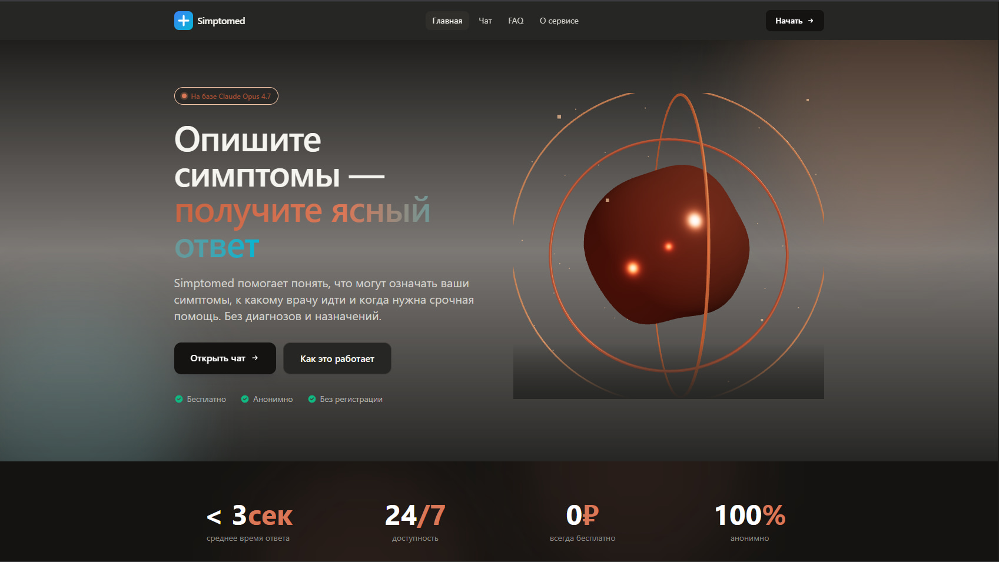

# Simptomed — AI-ассистент для первичной оценки симптомов

[](https://github.com/sbot666/simptomed/actions/workflows/ci.yml)
[](https://симптомед.рф)
     

> **Live demo:** https://симптомед.рф

Медицинский триаж-чат на базе Claude. Пользователь описывает симптомы — ассистент структурированно отвечает: возможные причины, к какому врачу идти, когда вызывать скорую, что можно сделать сейчас. При обнаружении «красных флагов» сразу маршрутизирует в 103 / 112.



---

## Architecture

```
┌─────────────┐        ┌──────────────────────────┐        ┌──────────────────┐
│   Browser   │  POST  │  Next.js API Route       │  SSE   │  Anthropic API   │
│             │ ─────▶ │  /api/chat               │ ─────▶ │  Claude Opus 4.7 │
│ ChatInterface│ stream │  • validate input        │        │  • adaptive      │
│ (React, RSC)│ ◀───── │  • rate-limit (IP, 20/m) │ ◀───── │    thinking      │
│             │ chunks │  • parse SSE deltas      │        │  • prompt cache  │
└─────────────┘        │  • re-stream as plain text│        │    (ephemeral)   │
                       └──────────────────────────┘        └──────────────────┘
                              │
                              ▼
                       ┌────────────────┐
                       │ In-memory      │
                       │ sliding-window │
                       │ rate limiter   │
                       └────────────────┘
```

**Что происходит за один запрос:**

1. Клиент отправляет `messages[]` в `/api/chat` (валидируется: роли, длина, порядок).
2. API-роут проверяет IP-rate limit (sliding window, in-memory).
3. Запрос идёт в Anthropic API с `stream: true`, `thinking: adaptive` и `cache_control: ephemeral` на большом системном промпте.
4. Роут парсит SSE (`content_block_delta` → `text_delta`) и ре-стримит клиенту как `text/plain` (`ReadableStream`).
5. Клиент читает chunk’и через `getReader()` + `TextDecoder` и рендерит Markdown по мере поступления. `AbortController` позволяет остановить генерацию.
6. История диалога хранится в `localStorage` (TTL 24 ч) — на сервере ничего не сохраняется.

---

## Key engineering decisions

| Решение | Почему |
|---|---|
| **Next.js 14 App Router, RSC для лендинга** | Тяжёлый 3D-hero и секции рендерятся как серверные компоненты; интерактивный чат — отдельный `"use client"` бандл. Чистая граница «статика ↔ интерактив». |
| **Прямой `fetch` к Anthropic вместо SDK** | Нужен контроль над SSE-парсингом (толерантность к прокси, которые ломают blank-line-separated SSE). SDK добавил бы зависимость ради удобства, которое здесь не нужно. |
| **Re-streaming как `text/plain`** | Клиенту не нужны служебные SSE-события — только текст. Это убирает парсер на клиенте и упрощает обработку ошибок. |
| **Prompt caching на system prompt** | Промпт ~11KB (≈ 2.5K токенов), стабилен между запросами. С `cache_control: ephemeral` повторные запросы читают кеш → ~90% экономии на input-токенах. |
| **Adaptive thinking (Opus 4.7)** | Триаж — задача неоднородной сложности (от «болит голова» до мультисимптомных случаев). Adaptive thinking сам решает, когда думать глубже. |
| **In-memory rate limiter** | Достаточно для single-instance Vercel Function. Для x10 нагрузки — Redis/Upstash (см. trade-offs). |
| **localStorage + TTL 24 ч** | Ноль PII на сервере, регистрация не нужна. Пользователь сам владеет историей. |
| **Строгий медицинский system prompt** | Никаких диагнозов, никаких названий препаратов, обязательный clarification loop, жёсткая 4-блочная структура ответа, красные флаги → немедленная маршрутизация в скорую. |

---

## Trade-offs и что улучшить при росте нагрузки

| Сейчас | При x10 / продакшн | Цена решения |
|---|---|---|
| In-memory rate limit | Redis / Upstash со sliding window | ~$0 на Upstash free tier |
| localStorage history | Опциональный cloud sync через encrypted blob | требует auth |
| Прямой `fetch` к Anthropic | Очередь (BullMQ) + retry/backoff для 529/5xx | +Redis worker |
| Логи в `console.error` | Structured logging (pino) + Sentry | 5 минут интеграции |
| Нет метрик | OpenTelemetry → Grafana / Vercel Analytics | бесплатно на Vercel |
| Unit-тестов нет | Vitest на rate-limiter и SSE-парсер; Playwright на smoke-сценарий чата | пара вечеров |

---

## 🧠 Что внутри

### Продукт
- **Медицинский system prompt** с жёсткой структурой ответа (4 блока) и правилами красных флагов
- **Streaming-чат** с посимвольной выдачей ответа
- **Авто-алерт `🚨 СРОЧНО`** с кнопками звонка 103 / 112 при опасных симптомах
- **Автоматическая линкификация телефонов** (8-800-2000-122, 103, 112) → `tel:`
- **Примеры запросов**, история диалога в `localStorage` с TTL 24 ч, кнопки очистить/копировать/остановить

### UI / UX
- **3D-hero** на React Three Fiber: distorting-сфера + вращающиеся кольца + 80 частиц
- **Framer Motion** scroll-reveal анимации по всем секциям
- Адаптивный **Header** со scroll-эффектом, мобильное меню, индикатор активного таба через `layoutId`
- **Tilt-карточки** в `Features`
- `prefers-reduced-motion`, focus-visible, кастомный scrollbar
- Тёмная Claude-inspired палитра (тёплый near-black `#1a1917`, акцент `#d97757`)

### Бекенд (`/api/chat`)
- **Streaming** через `ReadableStream` + прямой `fetch` + кастомный SSE-парсер (толерантен к нестрогим SSE-прокси)
- **In-memory rate limiting** — sliding window, 20 req/min / IP
- Валидация входа: `role ∈ {user,assistant}`, max 20 сообщений, max 8000 символов
- **Prompt caching** (`cache_control: ephemeral`) на system-prompt (~11KB, >1K токенов)
- **Adaptive thinking** на Opus 4.7
- Корректный `AbortController` на стороне клиента для остановки стрима
- Все ошибки с русскими текстами и HTTP-кодами (400 / 429 / 500 / 502)

### Прочее
- **SEO:** `robots.ts`, `sitemap.ts`, OG-метаданные, favicon
- **Legal:** `/privacy`, `/terms`, `/faq`, `/about` + `/not-found`, `/error`, `/loading`
- **CI:** GitHub Actions — typecheck + lint + build на каждый push
- Production-deploy на Vercel с preview-деплоями на PR

---

## 📊 Bundle & performance

| Маршрут | First Load JS | Размер страницы |
|---|---|---|
| `/` (landing + 3D) | 147 kB | 10.9 kB |
| `/chat` | 167 kB | 40.6 kB |
| `/about`, `/faq`, `/privacy`, `/terms` | 127–134 kB | 0.7–4.2 kB |
| Shared chunks | 87.3 kB | — |

- ✅ `tsc --noEmit` — 0 ошибок
- ✅ `next lint` — 0 warnings
- ✅ `next build` — 14 маршрутов, prerender ok
- ✅ `vitest run` — 10/10 тестов (rate-limiter: sliding-window, IP-изоляция, retry-after, парсинг `x-forwarded-for`)

### Lighthouse (mobile, throttled)

<!-- TODO: заполнить после прогона `npx lighthouse https://simptomed.vercel.app --view` -->

| Метрика | `/` | `/chat` |
|---|---|---|
| Performance | TBD | TBD |
| Accessibility | TBD | TBD |
| Best Practices | TBD | TBD |
| SEO | TBD | TBD |
| LCP | TBD | TBD |
| CLS | TBD | TBD |

---

## 🧰 Стек

| Слой | Технология |
|---|---|
| Framework | **Next.js 14.2** (App Router, RSC) |
| Язык | **TypeScript 5.7** (strict) |
| UI | **Tailwind 3.4** + кастомная brand-палитра + keyframes |
| Анимации | **Framer Motion 11** |
| 3D | **React Three Fiber 8 + drei 9 + three 0.170** |
| LLM | **Claude Opus 4.7** (Anthropic API, streaming, adaptive thinking, prompt cache) |
| Markdown | **react-markdown 9** с кастомными компонентами |
| Hosting | **Vercel** |
| Testing | **Vitest 4** (unit, fake timers, module-reset isolation) |
| CI | **GitHub Actions** (typecheck · lint · test · build) |

---

## 🚀 Локальный запуск

```bash
git clone https://github.com/sbot666/simptomed.git
cd simptomed
npm install

# настройки окружения
cp .env.example .env.local
# заполните ANTHROPIC_API_KEY в .env.local

npm run dev
# → http://localhost:3000
```

### Переменные окружения

| Имя | Обязательна | По умолчанию | Описание |
|---|---|---|---|
| `ANTHROPIC_API_KEY` | **да** | — | Ключ Anthropic API (или совместимого прокси) |
| `ANTHROPIC_BASE_URL` | нет | `https://api.anthropic.com` | Перекрыть base URL (для прокси) |
| `ANTHROPIC_MODEL` | нет | `claude-opus-4-7` | Модель |

---

## 📁 Структура

```
app/
  api/chat/route.ts       # streaming-бекенд с SSE-парсером + rate limit
  chat/                   # страница чата
  about/  faq/  privacy/  terms/
  sitemap.ts  robots.ts  icon.svg
  layout.tsx  page.tsx  error.tsx  not-found.tsx  loading.tsx

components/
  HeroScene.tsx           # 3D Canvas (R3F)
  Hero.tsx  Features.tsx  HowItWorks.tsx  ForWhom.tsx
  Stats.tsx  FAQ.tsx  FinalCTA.tsx
  Header.tsx  Footer.tsx  Logo.tsx
  ChatInterface.tsx       # streaming-чат на клиенте
  MedicalResponse.tsx     # кастомный Markdown-рендер (красные алерты, tel:)
  TiltCard.tsx  PageHero.tsx

lib/
  system-prompt.ts        # медицинский system prompt (~11KB, кешируется)
  rate-limit.ts           # sliding-window rate limiter
```

---

## 🔒 Дисклеймер

Simptomed — **не медицинская консультация**. Сервис даёт первичную ориентацию: что может быть, к какому специалисту обратиться, когда нужна скорая помощь. Диагноз и лечение назначает только врач после очного осмотра. Система намеренно **не называет препараты и дозировки**.

При симптомах, требующих неотложной помощи (боль за грудиной, асимметрия лица, внезапная сильная головная боль, потеря сознания), звоните **103** или **112**.

---

## 📜 Лицензия

[MIT](./LICENSE)
